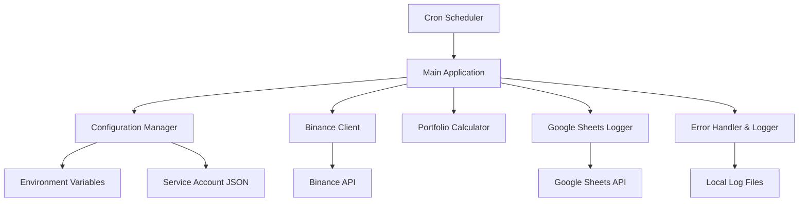

# Design Document

## Overview

The Binance Portfolio Logger is a Python-based application that runs as a scheduled service on a Proxmox Linux environment. The system follows a modular architecture with separate components for Binance API integration, Google Sheets logging, portfolio calculation, and configuration management. The design emphasizes security, reliability, and maintainability while adhering to API rate limits and providing comprehensive error handling.

## Architecture

The system follows a layered architecture pattern:



### Core Components

1. **Main Application** - Orchestrates the daily portfolio logging workflow
2. **Configuration Manager** - Handles secure credential loading and validation
3. **Binance Client** - Manages API connections and data retrieval from Binance
4. **Portfolio Calculator** - Converts asset balances to USDT values
5. **Google Sheets Logger** - Handles data persistence to Google Sheets
6. **Error Handler & Logger** - Provides centralized logging and error management

## Components and Interfaces

### Configuration Manager

**Purpose:** Securely loads and validates all configuration data and credentials.

**Interface:**
```python
class ConfigurationManager:
    def load_binance_credentials() -> BinanceCredentials
    def load_google_credentials() -> GoogleCredentials  
    def get_execution_config() -> ExecutionConfig
    def validate_configuration() -> bool
```

**Implementation Details:**
- Loads Binance API key/secret from environment variables (`BINANCE_API_KEY`, `BINANCE_API_SECRET`)
- Loads Google Service Account JSON from secure file path (environment variable `GOOGLE_SERVICE_ACCOUNT_PATH`)
- Validates file permissions (600) on credential files
- Provides default configuration values (execution timeout, retry counts, etc.)

### Binance Client

**Purpose:** Handles all interactions with the Binance API including authentication, balance retrieval, and price fetching.

**Interface:**
```python
class BinanceClient:
    def __init__(api_key: str, api_secret: str)
    def get_account_balances() -> List[AssetBalance]
    def get_all_prices() -> Dict[str, float]
    def get_price_for_asset(symbol: str) -> float
```

**Implementation Details:**
- Uses `python-binance` library for API interactions
- Implements exponential backoff for rate limit handling
- Filters out zero balances automatically
- Handles both spot and futures account balances if configured
- Implements connection pooling for efficient API usage

### Portfolio Calculator

**Purpose:** Converts asset balances to USDT values using current market prices.

**Interface:**
```python
class PortfolioCalculator:
    def __init__(binance_client: BinanceClient)
    def calculate_portfolio_value(balances: List[AssetBalance]) -> PortfolioValue
    def convert_asset_to_usdt(asset: str, amount: float) -> float
```

**Implementation Details:**
- Primary conversion: Direct USDT pairs (e.g., BTC/USDT)
- Secondary conversion: BTC pairs converted via BTC/USDT (e.g., ETH/BTC → BTC/USDT)
- Tertiary conversion: ETH pairs converted via ETH/USDT
- Logs assets that cannot be converted and assigns zero value
- Caches price data during single execution to avoid redundant API calls

### Google Sheets Logger

**Purpose:** Manages data persistence to Google Sheets with retry logic and error handling.

**Interface:**
```python
class GoogleSheetsLogger:
    def __init__(credentials_path: str, spreadsheet_id: str)
    def append_portfolio_data(portfolio_value: PortfolioValue) -> bool
    def validate_sheet_access() -> bool
```

**Implementation Details:**
- Uses `gspread` library with service account authentication
- Target sheet: "Binance Portfolio" (creates if doesn't exist)
- Row format: [Timestamp, Total USDT Value, Optional Asset Breakdown]
- Implements retry logic with exponential backoff (3 attempts)
- Validates sheet permissions on initialization

### Error Handler & Logger

**Purpose:** Provides centralized logging, error handling, and monitoring capabilities.

**Interface:**
```python
class ErrorHandler:
    def setup_logging(log_file: str = "/var/log/binance-portfolio.log")
    def log_execution_start()
    def log_execution_success(portfolio_value: float)
    def log_execution_failure(error: Exception)
    def handle_api_error(error: Exception) -> bool  # Returns if retry should occur
```

**Implementation Details:**
- Structured logging with timestamps, severity levels, and context
- Separate log files for application logs and error logs
- Log rotation to prevent disk space issues
- Sanitizes sensitive data from log outputs
- Provides execution metrics (duration, API call counts, etc.)

## Data Models

### Core Data Structures

```python
@dataclass
class AssetBalance:
    asset: str
    free: float
    locked: float
    total: float

@dataclass
class PortfolioValue:
    timestamp: datetime
    total_usdt: float
    asset_breakdown: Dict[str, float]
    conversion_failures: List[str]

@dataclass
class BinanceCredentials:
    api_key: str
    api_secret: str

@dataclass
class GoogleCredentials:
    service_account_path: str
    spreadsheet_id: str
    sheet_name: str = "Binance Portfolio"

@dataclass
class ExecutionConfig:
    timeout_seconds: int = 60
    max_retries: int = 3
    log_file_path: str = "/var/log/binance-portfolio.log"
```

## Error Handling

### Error Categories and Responses

1. **Configuration Errors**
   - Missing credentials → Fail fast with clear error message
   - Invalid file permissions → Log security warning and exit
   - Missing environment variables → Provide setup instructions

2. **API Errors**
   - Binance rate limits → Exponential backoff with max 3 retries
   - Network connectivity → Retry with increasing delays
   - Authentication failures → Log error and exit (no retry)
   - Invalid API response → Log details and continue with available data

3. **Google Sheets Errors**
   - Authentication failures → Log error and exit
   - Sheet not found → Attempt to create sheet, then retry
   - Write failures → Retry up to 3 times, then log locally

4. **System Errors**
   - Insufficient permissions → Log error with remediation steps
   - Disk space issues → Clean old logs and continue
   - Memory constraints → Log warning and optimize data structures

### Retry Strategy

- **Exponential Backoff:** Base delay of 1 second, multiplied by 2^attempt_number
- **Maximum Retries:** 3 attempts for API calls, 3 attempts for Google Sheets
- **Circuit Breaker:** After 5 consecutive failures, skip execution and alert
- **Graceful Degradation:** Continue with partial data when possible

## Testing Strategy

### Unit Testing

- **Configuration Manager:** Test credential loading, validation, and error cases
- **Binance Client:** Mock API responses, test rate limit handling, error scenarios
- **Portfolio Calculator:** Test conversion logic with various asset combinations
- **Google Sheets Logger:** Mock Google API, test retry logic and data formatting
- **Error Handler:** Test logging functionality and error categorization

### Integration Testing

- **End-to-End Workflow:** Test complete execution flow with test credentials
- **API Integration:** Test against Binance testnet and Google Sheets test document
- **Error Scenarios:** Simulate network failures, API errors, and recovery
- **Performance Testing:** Validate execution time constraints with large portfolios

### Deployment Testing

- **Environment Validation:** Test on target Proxmox environment
- **Cron Integration:** Validate scheduled execution and logging
- **Security Testing:** Verify credential security and file permissions
- **Monitoring:** Test log file creation and rotation

### Test Data Management

- **Mock Data:** Create realistic portfolio data for testing
- **Test Credentials:** Use dedicated test API keys and test Google Sheet
- **Environment Isolation:** Separate test and production configurations
- **Automated Testing:** CI/CD pipeline for regression testing

## Security Considerations

### Credential Management
- Environment variables for API keys (never hardcoded)
- Service account JSON files with 600 permissions
- Credential validation on startup
- No logging of sensitive data

### API Security
- Read-only Binance API permissions
- IP whitelisting for API access (optional)
- Rate limit compliance to avoid account restrictions
- Secure HTTP connections (TLS 1.2+)

### System Security
- Minimal system privileges for execution user
- Log file access restrictions
- Regular security updates for dependencies
- Network firewall rules for API access only

## Deployment Architecture

### Proxmox Setup Options

**Option 1: LXC Container (Recommended)**
- Lightweight container with Ubuntu 22.04 LTS
- Minimal resource usage (512MB RAM, 1 vCPU, 8GB storage)
- Easy backup and migration
- Isolated environment for security

**Option 2: Virtual Machine**
- Full Ubuntu 22.04 LTS VM
- More resource overhead but complete OS isolation
- Better for complex networking requirements

### Installation and Configuration

#### System Preparation
1. **Create Proxmox Container/VM:**
   - Template: Ubuntu 22.04 LTS
   - Resources: 512MB RAM, 1 vCPU, 8GB storage
   - Network: Bridge to main network with internet access

2. **System Updates:**
   ```bash
   apt update && apt upgrade -y
   apt install python3 python3-pip python3-venv git cron -y
   ```

3. **User Setup:**
   ```bash
   useradd -m -s /bin/bash binance-logger
   usermod -aG sudo binance-logger  # Temporary for setup
   ```

#### Application Deployment
1. **Create Application Directory:**
   ```bash
   mkdir -p /opt/binance-portfolio-logger
   chown binance-logger:binance-logger /opt/binance-portfolio-logger
   ```

2. **Python Environment:**
   ```bash
   cd /opt/binance-portfolio-logger
   python3 -m venv venv
   source venv/bin/activate
   pip install python-binance gspread python-dotenv
   ```

3. **Configuration Setup:**
   ```bash
   # Create environment file
   touch /opt/binance-portfolio-logger/.env
   chmod 600 /opt/binance-portfolio-logger/.env
   chown binance-logger:binance-logger /opt/binance-portfolio-logger/.env
   
   # Create Google Service Account directory
   mkdir -p /opt/binance-portfolio-logger/credentials
   chmod 700 /opt/binance-portfolio-logger/credentials
   ```

4. **Log Directory Setup:**
   ```bash
   mkdir -p /var/log/binance-portfolio
   chown binance-logger:binance-logger /var/log/binance-portfolio
   chmod 755 /var/log/binance-portfolio
   ```

#### Credential Configuration
1. **Environment Variables (.env file):**
   ```bash
   BINANCE_API_KEY=your_binance_api_key_here
   BINANCE_API_SECRET=your_binance_api_secret_here
   GOOGLE_SERVICE_ACCOUNT_PATH=/opt/binance-portfolio-logger/credentials/service-account.json
   GOOGLE_SPREADSHEET_ID=your_google_sheet_id_here
   LOG_FILE_PATH=/var/log/binance-portfolio/portfolio.log
   ```

2. **Google Service Account Setup:**
   - Download service account JSON from Google Cloud Console
   - Copy to `/opt/binance-portfolio-logger/credentials/service-account.json`
   - Set permissions: `chmod 600 service-account.json`

#### Cron Job Configuration
```bash
# Edit crontab for binance-logger user
sudo -u binance-logger crontab -e

# Add daily execution at 8:00 AM
0 8 * * * /opt/binance-portfolio-logger/venv/bin/python /opt/binance-portfolio-logger/main.py >> /var/log/binance-portfolio/cron.log 2>&1
```

#### Security Hardening
1. **Remove sudo access after setup:**
   ```bash
   deluser binance-logger sudo
   ```

2. **File Permissions:**
   ```bash
   chmod 750 /opt/binance-portfolio-logger
   chmod 600 /opt/binance-portfolio-logger/.env
   chmod 600 /opt/binance-portfolio-logger/credentials/*
   ```

3. **Firewall Rules (if needed):**
   ```bash
   # Allow outbound HTTPS only
   ufw allow out 443
   ufw deny out 80  # Force HTTPS
   ```

### Monitoring and Maintenance

#### Log Rotation
```bash
# Create logrotate configuration
cat > /etc/logrotate.d/binance-portfolio << EOF
/var/log/binance-portfolio/*.log {
    daily
    rotate 30
    compress
    delaycompress
    missingok
    notifempty
    create 644 binance-logger binance-logger
}
EOF
```

#### Health Monitoring
- Check cron execution: `grep binance-portfolio /var/log/syslog`
- Monitor application logs: `tail -f /var/log/binance-portfolio/portfolio.log`
- Verify Google Sheets updates daily

#### Backup Strategy
- Proxmox container/VM snapshots before updates
- Configuration backup: `/opt/binance-portfolio-logger/.env` and credentials
- Log retention policy: 30 days local, longer-term in Google Sheets

### Troubleshooting Guide

#### Common Issues
1. **API Connection Failures:**
   - Verify internet connectivity: `ping api.binance.com`
   - Check API key permissions in Binance
   - Validate environment variables

2. **Google Sheets Access:**
   - Verify service account permissions
   - Check spreadsheet sharing settings
   - Validate JSON credential file format

3. **Cron Job Issues:**
   - Check cron service: `systemctl status cron`
   - Verify user permissions: `sudo -u binance-logger -i`
   - Review cron logs: `/var/log/binance-portfolio/cron.log`

4. **Resource Constraints:**
   - Monitor container resources in Proxmox
   - Check disk space: `df -h`
   - Monitor memory usage: `free -h`